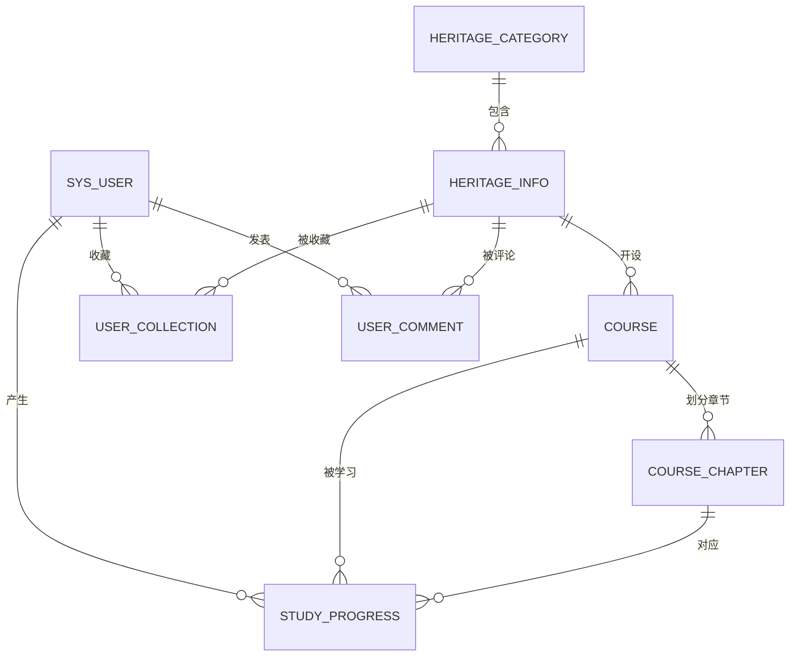

# 非遗知识教学平台 —— 阶段1：需求分析与数据库设计

> 毕设项目文档，可直接作为论文"系统分析"与"数据库设计"章节的素材。
> 配套建表脚本：[sql/heritage_teaching_platform.sql](../sql/heritage_teaching_platform.sql)

---

## 1. 系统概述

非遗知识教学平台是一个面向中华优秀传统文化传播的综合性教学平台，采用前后端分离架构，分为**用户前台展示端**和**管理员后台管理端**。平台以非遗项目知识为核心内容，围绕非遗项目组织图文介绍与体系化视频课程，为普通用户提供非遗知识浏览、收藏、评论与课程学习服务，为管理员提供全部业务数据的管理与审核能力。

## 2. 系统角色与功能需求

### 2.1 普通用户（前台展示端）

| 功能模块 | 功能点 |
| --- | --- |
| 账号 | 注册、登录、修改个人资料（昵称/头像/简介等） |
| 首页 | 轮播图展示、系统公告展示、分类导航、非遗项目推荐 |
| 非遗知识 | 按分类/级别/关键词浏览非遗项目列表，查看项目详情（简介+富文本详情） |
| 互动 | 收藏/取消收藏非遗项目，发表评论、浏览评论 |
| 课程学习 | 按非遗项目查看课程列表，进入课程按章节观看视频、阅读讲义 |
| 个人中心 | 我的收藏列表、我的学习进度（按课程查看章节完成情况与累计学习时长） |

### 2.2 系统管理员（后台管理端）

| 功能模块 | 功能点 |
| --- | --- |
| 账号 | 管理员登录 |
| 用户管理 | 用户列表（多条件查询）、禁用/启用账号、重置密码、逻辑删除 |
| 分类管理 | 非遗分类的增删改查、排序 |
| 非遗项目管理 | 非遗项目的发布/编辑/删除（含富文本详情、封面上传）、级别与分类维护 |
| 课程管理 | 课程的增删改查，课程章节的维护（章节视频上传、排序） |
| 评论管理 | 评论列表查询、屏蔽/恢复违规评论、删除评论 |
| 轮播图管理 | 轮播图增删改查、排序、启用/停用 |
| 公告管理 | 公告的发布、下架、编辑、删除 |

### 2.3 非功能性需求（简要）

- 密码不得明文存储，采用 BCrypt 加密；
- 删除操作采用逻辑删除，保证数据可追溯；
- 浏览量、收藏数等统计字段采用冗余计数，由业务层维护，减少实时聚合查询。

## 3. 概念模型设计（ER 图）

### 3.1 实体及属性（文字描述）

| 实体 | 主要属性 |
| --- | --- |
| 用户 | 用户ID、用户名、密码、昵称、手机号、邮箱、头像、角色、个人简介、状态 |
| 非遗分类 | 分类ID、分类名称、分类描述、分类图标、排序号 |
| 非遗项目 | 项目ID、非遗名称、非遗级别、所属地区、传承人、简介、详细内容、封面、浏览量、收藏数、发布时间 |
| 课程 | 课程ID、课程名称、课程简介、课程封面、讲师、总时长、浏览量、发布时间 |
| 课程章节 | 章节ID、章节标题、视频地址、章节内容、排序号 |
| 轮播图 | 轮播图ID、图片地址、跳转链接、标题、排序号、状态 |
| 公告 | 公告ID、公告标题、公告内容、发布时间、状态 |

### 3.2 实体间联系（文字描述）

1. **非遗分类 —— 非遗项目**：一对多（1:N）。一个分类下包含多个非遗项目，一个非遗项目只属于一个分类。
2. **非遗项目 —— 课程**：一对多（1:N）。一个非遗项目可开设多门课程，一门课程只对应一个非遗项目。
3. **课程 —— 课程章节**：一对多（1:N）。一门课程包含多个章节，一个章节只属于一门课程。
4. **用户 —— 非遗项目（收藏）**：多对多（M:N）。转化为独立关联表 `user_collection`，联系属性为收藏时间。
5. **用户 —— 非遗项目（评论）**：多对多（M:N）。转化为独立关联表 `user_comment`，联系属性为评论内容、点赞数、评论时间、状态。
6. **用户 —— 课程章节（学习）**：多对多（M:N）。转化为独立关联表 `study_progress`，联系属性为学习时长、完成状态；该表同时冗余课程ID便于按课程统计。
7. **轮播图、公告**：独立实体，不与其他实体发生联系。

### 3.3 ER 图（Mermaid，可粘贴至支持 Mermaid 的工具渲染后重绘为 Visio/亿图图）

## 4. 逻辑模型设计（表清单与作用）

最终共 **10 张表**，字段级定义详见 SQL 脚本内注释。

| 序号 | 表名 | 中文名 | 作用说明 |
| --- | --- | --- | --- |
| 1 | `sys_user` | 系统用户表 | 存储普通用户与管理员账号，`role` 字段区分角色，登录鉴权与个人资料的数据来源 |
| 2 | `heritage_category` | 非遗分类表 | 非遗项目的一级分类（传统音乐、传统技艺、民俗等），支持自定义排序，用于前台分类导航 |
| 3 | `heritage_info` | 非遗项目表 | 平台核心内容表，存储非遗项目的级别、地区、传承人、图文详情等，收藏数/浏览量为冗余统计字段 |
| 4 | `course` | 课程表 | 围绕非遗项目开设的教学课程，记录讲师、总时长、封面等信息 |
| 5 | `course_chapter` | 课程章节表 | 课程的视频章节，含章节视频地址与图文讲义，按 `sort` 排序组织学习顺序 |
| 6 | `user_collection` | 用户收藏表 | 用户与非遗项目收藏联系的关联表，联合唯一索引防止重复收藏，取消收藏即物理删除 |
| 7 | `user_comment` | 评论表 | 用户对非遗项目的评论，管理员可屏蔽（status=0）违规评论，屏蔽后前台不展示 |
| 8 | `study_progress` | 学习进度表 | 用户学习课程章节的进度记录，含累计学习时长与完成状态，一人一章仅一条记录 |
| 9 | `banner` | 轮播图表 | 前台首页轮播图配置，支持排序与启用/停用 |
| 10 | `notice` | 系统公告表 | 平台公告的发布与下架管理，状态控制前台可见性 |

### 4.1 表间关联（业务层关联字段一览）

| 关联关系 | 关联字段（子表.字段 → 父表.字段） | 联系类型 |
| --- | --- | --- |
| 分类 → 非遗项目 | `heritage_info.category_id` → `heritage_category.id` | 1:N |
| 非遗项目 → 课程 | `course.heritage_id` → `heritage_info.id` | 1:N |
| 课程 → 课程章节 | `course_chapter.course_id` → `course.id` | 1:N |
| 用户 ↔ 非遗项目（收藏） | `user_collection.user_id` → `sys_user.id`；`user_collection.heritage_id` → `heritage_info.id` | M:N |
| 用户 ↔ 非遗项目（评论） | `user_comment.user_id` → `sys_user.id`；`user_comment.heritage_id` → `heritage_info.id` | M:N |
| 用户 ↔ 课程章节（学习进度） | `study_progress.user_id` → `sys_user.id`；`study_progress.course_id` → `course.id`；`study_progress.chapter_id` → `course_chapter.id` | M:N |

### 4.2 状态类字段取值约定汇总

| 表.字段 | 取值约定 |
| --- | --- |
| `sys_user.role` | `user`-普通用户，`admin`-系统管理员 |
| `sys_user.status` | `1`-正常，`0`-禁用 |
| `heritage_info.level` | `国家级` / `省级` / `市级` |
| `user_comment.status` | `1`-正常，`0`-屏蔽 |
| `study_progress.finished` | `1`-已完成，`0`-未完成 |
| `banner.status` | `1`-启用，`0`-停用 |
| `notice.status` | `1`-已发布，`0`-下架/草稿 |
| 各表 `deleted` | `0`-未删除，`1`-已删除 |

## 5. 物理设计规范

1. **命名规范**：表名、字段名统一小写下划线命名（snake_case）；关联字段统一为 `xxx_id`；时间字段统一为 `create_time` / `update_time` / `publish_time`，便于后端 MyBatis-Plus 自动填充。
2. **主键策略**：所有表采用 `BIGINT` 自增主键，不使用业务字段作主键，避免业务变更引发级联修改。
3. **外键策略**：不建立物理外键，表间关联由业务层维护；所有关联字段建立普通索引保证连接查询性能。优点：降低高并发写入时外键校验开销、便于后期分表扩展、简化批量导入。
4. **删除策略**：核心业务表（用户、分类、非遗项目、课程、评论、公告）采用 `deleted` 逻辑删除标记；从属/流水类数据（章节、收藏记录、学习进度）无独立保留价值，采用物理删除。
5. **字符集与引擎**：全库 `utf8mb4 / utf8mb4_general_ci`，完整支持四字节字符（emoji、生僻字）；存储引擎统一 `InnoDB`，支持事务与行级锁。
6. **时间字段**：统一 `DATETIME` 类型；`create_time` 默认 `CURRENT_TIMESTAMP`，`update_time` 支持 `ON UPDATE CURRENT_TIMESTAMP` 自动更新。
7. **索引设计**：除主键外——
   - `sys_user.username` 唯一索引，防止重复注册（若发生逻辑删除，删除账号的用户名仍被占用，可在删除时改写用户名规避，属业务层处理）；
   - `user_collection` 建立 `(user_id, heritage_id)` 联合唯一索引，防止重复收藏；
   - `study_progress` 建立 `(user_id, chapter_id)` 联合唯一索引，保证"一人一章一条进度"的业务约束落在数据库层；
   - 各关联字段（`category_id`、`heritage_id`、`course_id`、`user_id` 等）建立普通索引加速关联查询；`heritage_info.level` 建立普通索引支撑按级别筛选。
8. **与需求字段清单的差异说明**：在需求清单基础上，`heritage_info`、`course` 补充了 `create_time` 字段（满足创建时间审计与后台列表按创建时间排序的需要）；`user_comment.create_time` 即"评论时间"、`user_collection.create_time` 即"收藏时间"，命名与全库时间字段规范保持一致。

## 6. 数据库设计说明（论文用，约 850 字）

本系统采用 MySQL 8.0 关系型数据库存储业务数据，所有数据表统一使用 InnoDB 存储引擎和 utf8mb4 字符集。选择 InnoDB 是因为它支持事务和行级锁，能够保证收藏、评论、学习进度等并发写入场景下的数据一致性；选择 utf8mb4 是因为它完整支持四字节 Unicode 编码，可存储表情符号与生僻字，适应非遗文化内容的多样化表达。

数据库设计遵循"概念设计—逻辑设计—物理设计"三阶段方法。概念设计阶段，通过分析业务需求抽象出用户、非遗分类、非遗项目、课程、课程章节五个核心实体，以及轮播图、公告两个辅助实体。实体间存在三类联系：分类与非遗项目、非遗项目与课程、课程与章节之间均为一对多联系；用户与非遗项目之间存在收藏和评论两组多对多联系；用户与课程章节之间存在带"学习时长、完成状态"属性的多对多联系。逻辑设计阶段按照转换规则，将一对多联系并入"多"方实体，将多对多联系转化为独立关联表，最终得到 10 张数据表，并对每张表的字段、类型和约束进行了详细定义。

物理设计阶段遵循以下规范：其一，所有表采用 BIGINT 自增主键，不使用业务字段作主键，避免主键变更带来的级联影响。其二，不建立物理外键，表间关联由业务层维护，同时在关联字段上建立普通索引保证查询性能，这样既降低了高并发写入时外键校验的开销，也便于后期分库分表扩展。其三，核心业务表采用逻辑删除策略，通过 deleted 标记位实现，保证数据可追溯、防止误删导致数据丢失。其四，时间字段统一使用 datetime 类型，状态字段统一使用 tinyint 并以注释约定取值含义。其五，针对高频查询建立索引，如用户名唯一索引防止重复注册，收藏表建立（用户ID+非遗ID）联合唯一索引防止重复收藏，学习进度表建立（用户ID+章节ID）联合唯一索引，将"一人一章仅一条进度"的业务约束落实到数据库层。

综上，本数据库设计在完整支撑平台十大业务模块的同时，兼顾了数据一致性、查询性能与可维护性，为系统后端各业务模块提供了稳定可靠的存储支撑。

## 7. 阶段1验证记录

- 脚本：`sql/heritage_teaching_platform.sql`
- 执行环境：本机 MySQL 8.0.34（一次性沙箱实例验证，导入全程零报错）
- 表结构验证：10 张表全部创建成功，中文表注释正确；
- 数据验证：演示数据行数符合预期（用户 2、分类 6、非遗项目 4、课程 2、章节 5、收藏 2、评论 2、学习进度 2、轮播图 3、公告 2）；
- 字符集验证：utf8mb4 生效，emoji 图标（🎶 等）存取正常；
- 索引验证：`uk_username`、`uk_user_heritage(user_id,heritage_id)`、`uk_user_chapter(user_id,chapter_id)` 三个唯一索引均就位；
- 密码验证：种子密码为 BCrypt 密文，生成时已通过 `bcrypt.checkpw` 反向校验（明文 123456）。

> 说明：脚本通过 `CREATE DATABASE IF NOT EXISTS` 幂等创建 `heritage_teaching` 库，可重复执行。
